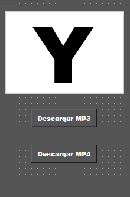
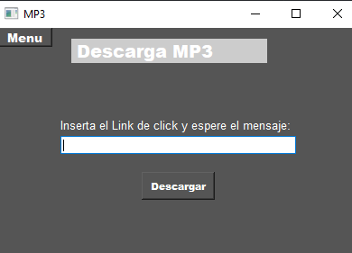
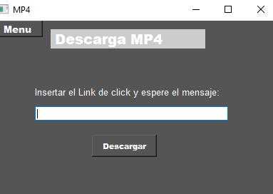

# DownloadYoutube
## Herramientas
*   Python
*   Qtdisainer
*   Pyside2

#

## Descripcion y Problematica
Realice esta app de escritorio para poder descargar videos de youtube en formato mp4 y mp3, para cuando no tenga internet poder distraerme.Además poder aprender a manejar librerías de python, entre otras herramientas que aprendí durante el desarollo de este app.

#

## Detalles de codigo
Los archivos reproductor.ui, mp3.ui y mp4.ui son los archivos generados por qtdisainer, los cuales son las ventanas gráficas de mi app, y los archivos ui_nombre.py son los archivos generados de las ventanas gráficas de Qtdisainer para el uso de sus clases ya preparadas para poder manejar los widgets de mi interfaz, el archivo main es el archivo donde se trabajó la lógica de todos los widgets, librerías etc.
el archivo core se usa para correr el programa solo desde ahí.

## Imagenes de Muestra

#

#

